## Pokémon Solus FR

**Pokémon Solus FR** est une traduction française du romhack [poke-solus-rgb](https://github.com/Dechrissen/poke-solus-rgb).

## Pokémon Solus RSE

This is **Pokémon Solus - Running Shoes Edition**, a fork of [poke-solus-rgb](https://github.com/Dechrissen/poke-solus-rgb).

This fork contains two branches:
- **runningshoes**: Adds running shoes, based on the implementations from [kep-hack](https://github.com/PlagueVonKarma/kep-hack) and [shinpokered](https://github.com/jojobear13/shinpokered).
- **solus-fr**: French translation, based on the [pokered-fr project](https://github.com/einstein95/pokered-fr). Also includes the running shoes patch (which can be disabled during the build process).

Refer to the original `README` below.

# Pokémon Solus RGB

Pokémon Solus RGB is a near-vanilla "faithful" romhack of Pokémon Red/Blue for Game Boy, with a focus on an enhanced **solo gameplay experience**. It is based on the [disassembly of Pokémon Red and Blue][pokered].

For a detailed look at all the changes in this romhack, check out the [feature log][featurelog].

Just want the patch? Go [here][releases].

## Table of Contents
- [Elevator pitch](#elevator-pitch)
- [Versions](#versions)
- [Installation](#installation)
- [Screenshots](#screenshots)
- [Links](#links)
- [Credits](#credits)

## Elevator pitch

**Pokémon Solus RGB** is a near-vanilla romhack of Gen 1. It changes _only a few things_ from the original games, without overhauling so much that it ceases to be Gen 1, and the whole thing becomes a [Ship of Theseus](https://en.wikipedia.org/wiki/Ship_of_Theseus) paradox.

Quick overview of changes:
1. All 151 Pokémon are obtainable through normal means
2. Some new gameplay features have been added
    - HMs can be taught to party Pokémon without using up one of their move slots
    - Four new TMs have been added to support forward-patched learnsets
    - Trades can be performed in-game via the Trader NPC
    - Battle HUD additions: EXP bar and 'already caught' indicator
    - Professor Oak can be battled after beating the Pokémon League
3. Pokémon learnsets have been partially forward-patched via Yellow Version and Gen 2 tradeback learnsets
4. Some visual content is changed (sprites)
5. Some bugs/oversights from vanilla are fixed

For a detailed look at all the changes, check out the [feature log][featurelog].

## Versions

There are three versions of this romhack: _Solus Red_, _Solus Green_, and _Solus Blue_. The differences between versions are solely cosmetic (palettes, title screen text, etc.), as this project consolidates any of the meaningful version-specific differences that existed across versions, such as Pokémon availability. For a complete list of version differences, check [here][versiondifferences].

[Building from source](#building-all-three-roms-from-source) will yield three ROMs:

- Solus Red (`pokesolusred.gbc`)
- Solus Green (`pokesolusgreen.gbc`)
- Solus Blue (`pokesolusblue.gbc`)

_Note_: Solus Green, if played on Game Boy Color, uses the GBC's built-in mostly-green palette. This is the same one which was used by the Japanese release of Pokémon Green Version.

## Installation

### Patching a vanilla ROM

To patch a vanilla Pokémon Red/Blue Version ROM, download a `.bps` patch file from the [releases page][releases], and then apply it to your ROM using [this online patcher](https://www.marcrobledo.com/RomPatcher.js/) or your patcher of choice.
- For Solus Red / Solus Green, patch a vanilla Red Version ROM
- For Solus Blue, patch a vanilla Blue Version ROM

### Building all three ROMs from source

If you're new to the [`pokered`][pokered] disassembly, learn how to install prerequisites and build the ROMs in the [install guide][installation].

Otherwise, if your environment for building the vanilla ROMs is already set up, the procedure here is the same. Just clone this repository, `cd` into it, and run `make`.

#### Modifying this romhack
If you want to make some tweaks to this romhack before building the ROMs, or if you want to use this romhack as a starting point for your own, read [this document][howtomod] that I've written.

## Screenshots

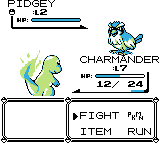
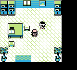
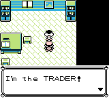
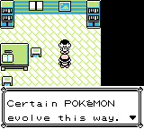
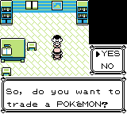
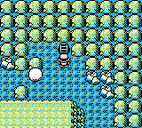
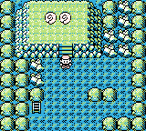
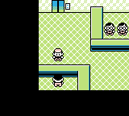

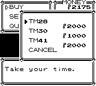

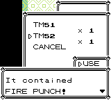
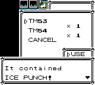
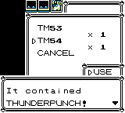
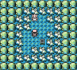
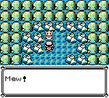
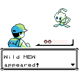
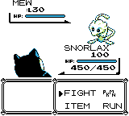
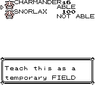
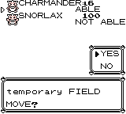

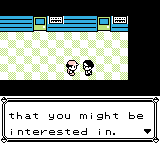
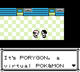
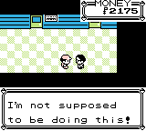
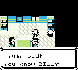

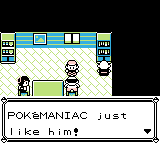

## Links

- [Solus RGB wiki][soluswiki]
- Comprehensive [feature log][featurelog] detailing all the changes in this romhack
- [Changelog][changelog] (an overview of the changes introduced in each Solus RGB release)
- [Planned features][planned]
- The [pokered disassembly][pokered] which this romhack is based on
- The [pokered wiki][wiki] which has many helpful tutorials
- The [pret Discord server][pretdiscord]
- [Shin Pokémon romhack][shinpokered] (credit to this romhack for the Field Move slot implementation)
- [pokeworld][pokeworld] (a very helpful tool for visualizing the Kanto overworld)
- [Polished Map][polishedmap] map/tileset editor
- My original (crude) [design document][designdoc] for this project
- [RomhackPlaza page][romhackplaza] for Solus RGB
- [Testimonials][testimonials] Solus RGB has received
- A [blog post][blogpost] I wrote about this project
- A [video essay][videoessay] I made about this project
- My [Ko-fi page][kofi] (if you'd like to support this project and the rest of my work)

## Credits
Thank you to [pret][pret], the entire [pret Discord server][pretdiscord], and these individuals who were very helpful throughout my work on this project:
- [jojobear13][jojobear13], for the Field Move slot implementation
- [Vortiene][Vortyne], for assistance with assembly and `pokered`
- [unlink2][unlink2], for assistance with Makefile functionality
- [Quadrixis][quadrixis], for collaboration on theorycrafting and general support

## Support the Solus RGB Developer
If you want to show your support, you could give this repository a :star: or simply share it with someone who might be interested.

Or if you would like to make a small donation, my Ko-fi page is [here][kofi].

Any form of support is greatly appreciated!

[pokered]: https://github.com/pret/pokered
[pret]: https://github.com/pret
[wiki]: https://github.com/pret/pokered/wiki
[pretdiscord]: https://discord.gg/d5dubZ3
[shinpokered]: https://github.com/jojobear13/shinpokered
[designdoc]: docs/DESIGN.md
[featurelog]: docs/FEATURES.md
[versiondifferences]: docs/FEATURES.md#version-differences
[installation]: docs/INSTALL.md
[howtomod]: docs/HOW-TO-MOD.md
[changelog]: docs/CHANGELOG.md
[planned]: docs/PLANNED.md
[releases]: https://github.com/Dechrissen/poke-solus-rgb/releases
[pokeworld]: https://www.extratricky.com/pokeworld/rb/1
[polishedmap]: https://github.com/Rangi42/polished-map
[blogpost]: https://derekandersen.net/blog/pokemon-solus-rgb
[kofi]: https://ko-fi.com/dechrissen
[romhackplaza]: https://romhackplaza.org/romhacks/pokemon-solus-rgb-game-boy/
[videoessay]: https://www.youtube.com/watch?v=ANRiLuondLE
[testimonials]: docs/TESTIMONIALS.md
[soluswiki]: https://github.com/Dechrissen/poke-solus-rgb/wiki

[jojobear13]: https://github.com/jojobear13
[Vortyne]: https://github.com/Vortyne
[unlink2]: https://krickl.dev/
[quadrixis]: https://github.com/Quadrixis