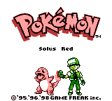
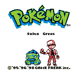
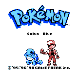

# Pokémon Solus RGB

Pokémon Solus RGB is a near-vanilla "purist" romhack of Pokémon Red/Blue for Game Boy, with a focus on an enhanced **solo gameplay experience**. It is based on the [disassembly of Pokémon Red and Blue][pokered].

For a detailed look at all the changes in this romhack, check out the [feature log][featurelog].

Just want the patch? Go [here][releases].

## Table of Contents
- [Elevator pitch](#elevator-pitch)
- [Versions](#versions)
- [Installation](#installation)
- [Links](#links)
- [Credits](#credits)

## Elevator pitch

**Pokémon Solus RGB** is a near-vanilla romhack of Gen 1. It changes _only a few things_ from the original games, without overhauling so much that it ceases to be Gen 1, and the whole thing becomes a [Ship of Theseus](https://en.wikipedia.org/wiki/Ship_of_Theseus) paradox.

Quick overview of changes:
1. All 151 Pokémon are obtainable through normal means
2. HMs can be taught to party Pokémon without using up one of their move slots
3. Some new content is added, and some visual content is changed
4. Some bugs/oversights are fixed

For a detailed look at all the changes, check out the [feature log][featurelog].

## Versions

There are three versions of this romhack: _Solus Red_, _Solus Green_, and _Solus Blue_. The differences between versions are solely cosmetic (palettes, title screen text, etc.), as this project consolidates any of the meaningful version-specific differences that existed across versions, such as Pokémon availability. For a complete list of version differences, check the ['Version differences' section of the feature log][versiondifferences].

[Building from source](#building-all-three-roms-from-source) will yield three ROMs:

- Solus Red (`pokesolusred.gbc`)
- Solus Green (`pokesolusgreen.gbc`)
- Solus Blue (`pokesolusblue.gbc`)

_Note_: Solus Green is inspired by the original Japanese release of Green Version. If played on Game Boy Color, you will see the GBC's mostly-green palette which was used for the Japanese release of Pokémon Green Version.

## Installation

### Patching a vanilla ROM

To patch a vanilla Pokémon Red/Blue Version ROM, download a `.bps` patch file from the [patches directory][patches], and then apply it to your ROM using [this online patcher](https://www.marcrobledo.com/RomPatcher.js/) or your patcher of choice.
- For Solus Red / Solus Green, patch a vanilla Red Version ROM
- For Solus Blue, patch a vanilla Blue Version ROM

### Building all three ROMs from source

If you're new to the [`pokered`][pokered] disassembly, learn how to install prerequisites and build the ROMs in the [install guide][installation].

Otherwise, if your environment for building the vanilla ROMs is already set up, the procedure here is the same. Just clone this repository, `cd` into it, and run `make`.

#### Modifying this romhack
If you want to make some tweaks to this romhack before building the ROMs, or if you want to use this romhack as a starting point for your own, read [this document][howtomod] that I've written.

## Links

- Comprehensive [feature log][featurelog] containing all of the changes this romhack makes
- [Changelog][changelog] for an overview of the changes introduced in each Solus RGB release
- The [pokered][pokered] disassembly which this romhack is based on
- The [pokered wiki][wiki] which has many helpful tutorials on working with the source code, some of which were used for this project
- The [pret Discord server][pretdiscord]
- [Shin Pokémon romhack][shinpokered] (Field Move slot implementation was taken from here)
- [pokeworld][pokeworld] (a very helpful tool for visualizing the Kanto overworld)
- [Polished Map][polishedmap] map/tileset editor
- My original [design document][designdoc] for this project (FYI: some things have changed since I drafted this)
- [RomhackPlaza page][romhackplaza] for Solus RGB
- [Testimonials][testimonials] this romhack has received
- A [blog post][blogpost] I wrote about this project
- A [video essay][videoessay] I made about this project
- My [Ko-fi page][kofi] (if you'd like to support this project and the rest of my work)

## Credits
Thank you to the entire [pret Discord server][pretdiscord], the [pret][pret] group, and these individuals who were very helpful throughout my work on this project:
- [jojobear13][jojobear13], for help with the Field Move slot implementation
- [Vortiene][Vortyne], for a lot of general `pokered`-related help
- [Quadrixis][quadrixis], for theorycrafting help

## Support the Solus RGB Developer
If you want to show your support, you could give this repository a :star: or simply share it with someone who might be interested.

Or if you would like to make a small donation, my Ko-fi page is [here][kofi].

Any form of support is greatly appreciated!

[pokered]: https://github.com/pret/pokered
[pret]: https://github.com/pret
[wiki]: https://github.com/pret/pokered/wiki
[pretdiscord]: https://discord.gg/d5dubZ3
[shinpokered]: https://github.com/jojobear13/shinpokered
[designdoc]: docs/DESIGN.md
[featurelog]: docs/FEATURES.md
[versiondifferences]: docs/FEATURES.md#version-differences
[installation]: docs/INSTALL.md
[howtomod]: docs/HOW-TO-MOD.md
[patches]: /patches
[changelog]: docs/CHANGELOG.md
[releases]: https://github.com/Dechrissen/poke-solus-rgb/releases
[pokeworld]: https://www.extratricky.com/pokeworld/rb/1
[polishedmap]: https://github.com/Rangi42/polished-map
[blogpost]: https://derekandersen.net/blog/pokemon-solus-rgb
[kofi]: https://ko-fi.com/dechrissen
[romhackplaza]: https://romhackplaza.org/romhacks/pokemon-solus-rgb-game-boy/
[videoessay]: https://www.youtube.com/watch?v=ANRiLuondLE
[testimonials]: docs/TESTIMONIALS.md

[jojobear13]: https://github.com/jojobear13
[Vortyne]: https://github.com/Vortyne
[quadrixis]: https://github.com/Quadrixis